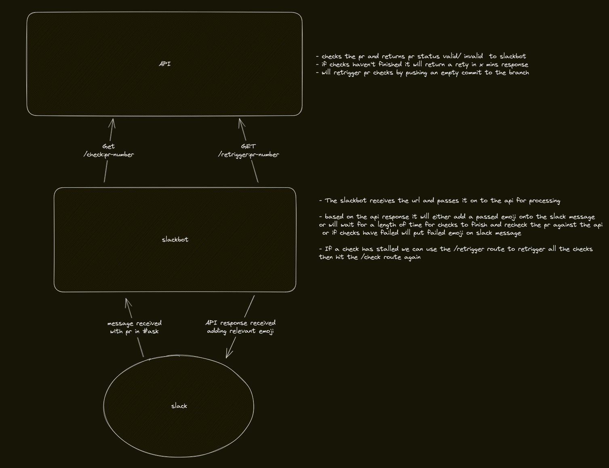
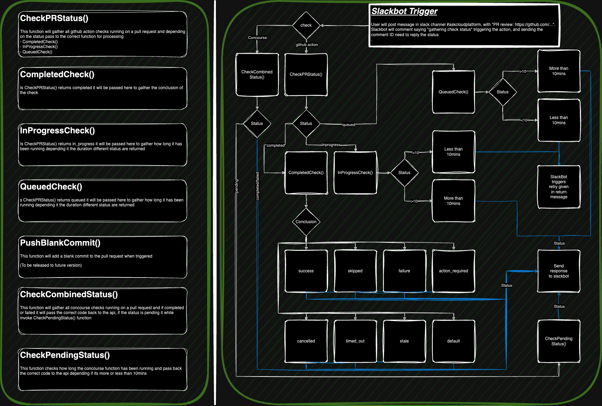

# cloud-platform-hammer-bot

TODO: 

AFTER:
- we should also think about in the future pushing an empty commit to retrigger the check (separate api route)
- accept an array of pr numbers
- remove api ingress and call the api from the slack bot via the api service

SLACKBOT:
- final step call the api from the slackbot and then post relevant emojis

1. read the post in ask
2. if it has the github pr url in the message, pull out all the pr numbers
3. for each pr number call the api
4. collate the responses
5. based on the responses apply relevant emojis
6. if the checks are still pending then retry based on the retryIn field from the api

